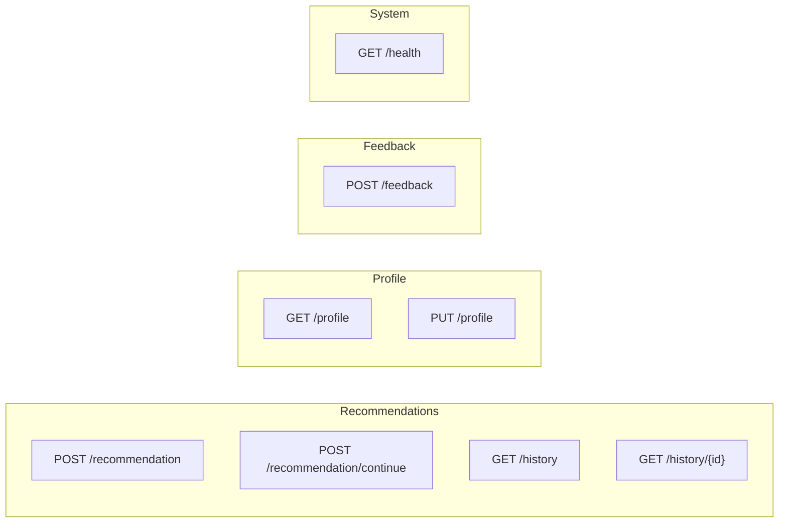
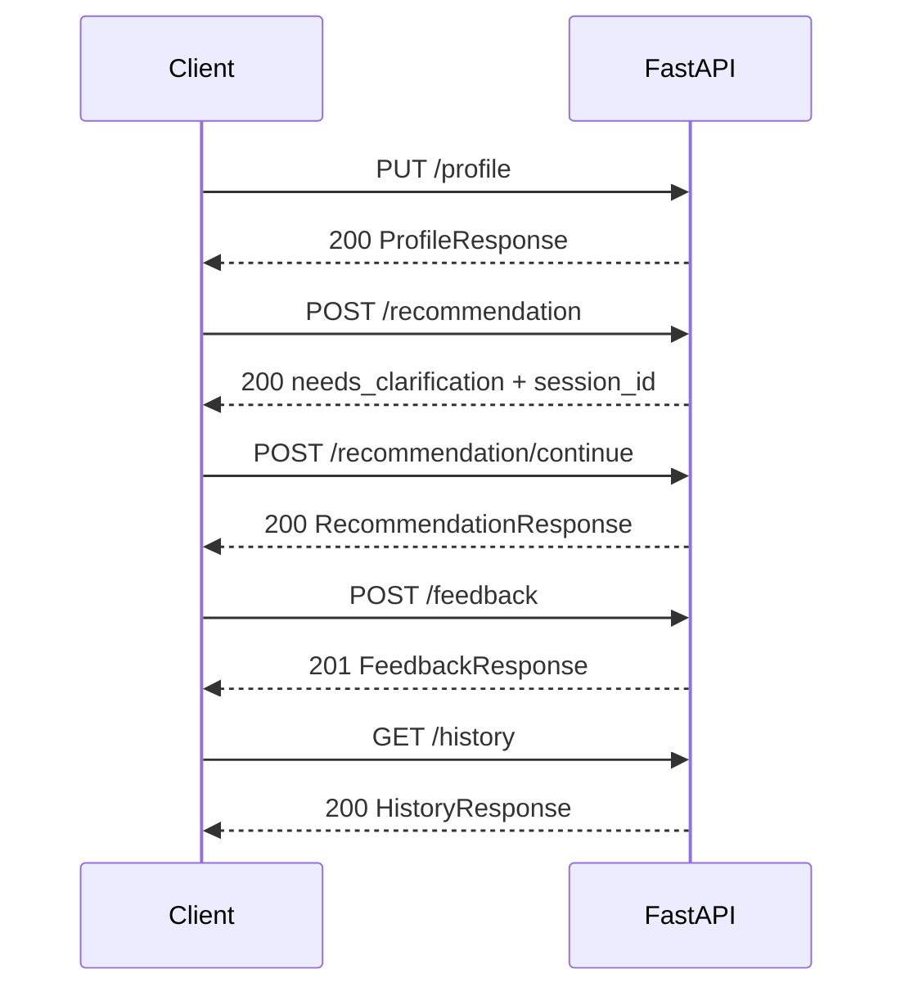

# API-спецификация

Базовый URL: `http://localhost:8000` (настраивается через `.env`).

Интерактивная документация: `http://localhost:8000/docs` (Swagger UI).

## Обзор эндпоинтов



| Метод | Путь | Описание |
|-------|------|----------|
| `POST` | `/recommendation` | Начать сценарий: анализ запроса, уточнения или сразу рекомендация |
| `POST` | `/recommendation/continue` | Ответить на уточняющие вопросы, получить рекомендацию |
| `GET` | `/history` | Список прошлых рекомендаций (пагинация) |
| `GET` | `/history/{id}` | Детали одной рекомендации |
| `GET` | `/profile` | Получить профиль пользователя (MVP: единственный) |
| `PUT` | `/profile` | Создать или обновить профиль |
| `POST` | `/feedback` | Оценить рекомендацию |
| `GET` | `/health` | Проверка доступности API |

---

## `POST /recommendation`

Начать сценарий рекомендации досуга.

### Request

**Headers:**

```
Content-Type: application/json
```

**Body:**

```json
{
  "user_query": "Не знаю, как провести субботу в Москве",
  "profile_id": 1,
  "use_profile": true
}
```

| Поле | Тип | Обязательное | По умолчанию | Описание |
|------|-----|--------------|--------------|----------|
| `user_query` | `string` | да | — | Описание ситуации (5–1000 символов) |
| `profile_id` | `integer` | нет | `null` | ID профиля для персонализации |
| `use_profile` | `boolean` | нет | `true` | Учитывать профиль в промпте |

### Response `200 OK` — нужны уточнения

```json
{
  "status": "needs_clarification",
  "session_id": 42,
  "questions": [
    {
      "id": "budget",
      "text": "Какой у вас примерный бюджет на день?",
      "hint": "Например: до 3000 ₽ или бесплатно"
    },
    {
      "id": "company",
      "text": "Планируете провести время один или с компанией?",
      "hint": null
    },
    {
      "id": "activity",
      "text": "Предпочитаете спокойный или активный отдых?",
      "hint": null
    }
  ],
  "message": "Чтобы предложить подходящие варианты, уточните несколько деталей."
}
```

### Response `200 OK` — рекомендация сразу

```json
{
  "status": "completed",
  "recommendation_id": 15,
  "session_id": 42,
  "user_query": "Хочу спокойно провести вечер дома после тяжёлой недели",
  "main_recommendation": "Устройте домашний киновечер: выберите фильм из списка ожидания, приготовьте чай или какао, отключите уведомления на телефоне на 2 часа.",
  "alternatives": [
    {
      "title": "Вечер настольных игр",
      "description": "Если есть компания — настольная игра с простыми правилами и лёгкими закусками.",
      "budget_estimation": "500–1500 ₽",
      "time_estimation": "2–3 часа"
    },
    {
      "title": "Медитация и чтение",
      "description": "30 минут медитации, затем чтение бумажной книги без экранов.",
      "budget_estimation": "бесплатно",
      "time_estimation": "1.5–2 часа"
    }
  ],
  "reasoning": "Запрос явно указывает на потребность в восстановлении и минимуме внешних стимулов. Домашний формат снижает стресс от планирования.",
  "budget_estimation": "500–2000 ₽",
  "time_estimation": "2–4 часа",
  "created_at": "2026-06-19T14:30:00Z"
}
```

---

## `POST /recommendation/continue`

Продолжить сценарий после уточняющих вопросов.

### Request

```json
{
  "session_id": 42,
  "answers": [
    { "question_id": "budget", "answer": "До 5000 ₽" },
    { "question_id": "company", "answer": "С другом" },
    { "question_id": "activity", "answer": "Умеренно активный" }
  ]
}
```

| Поле | Тип | Обязательное | Описание |
|------|-----|--------------|----------|
| `session_id` | `integer` | да | ID сессии из предыдущего ответа |
| `answers` | `array` | да | 1–10 ответов на вопросы |
| `answers[].question_id` | `string` | да | ID вопроса из `questions` |
| `answers[].answer` | `string` | да | Ответ пользователя (1–500 символов) |

### Response `200 OK`

Тело — `RecommendationResponse` (см. пример выше, `status: "completed"`).

### Коды ошибок

| Код | Условие |
|-----|---------|
| `404` | Сессия не найдена |
| `409` | Сессия не в статусе `awaiting_answers` |
| `410` | Сессия истекла (TTL) |
| `422` | Неизвестный `question_id` или не все вопросы отвечены |

---

## `GET /history`

Список сохранённых рекомендаций.

### Query-параметры

| Параметр | Тип | По умолчанию | Описание |
|----------|-----|--------------|----------|
| `limit` | `integer` | 20 | 1–100 |
| `offset` | `integer` | 0 | Смещение |

### Response `200 OK`

```json
{
  "items": [
    {
      "id": 15,
      "user_query": "Не знаю, как провести субботу в Москве",
      "main_recommendation": "Прогулка по парку Горького с остановкой в кафе на ВДНХ...",
      "budget_estimation": "2000–5000 ₽",
      "time_estimation": "4–6 часов",
      "created_at": "2026-06-19T14:30:00Z",
      "has_feedback": true
    }
  ],
  "total": 1,
  "limit": 20,
  "offset": 0
}
```

---

## `GET /history/{id}`

Детали одной рекомендации.

### Response `200 OK`

```json
{
  "id": 15,
  "session_id": 42,
  "user_query": "Не знаю, как провести субботу в Москве",
  "context": {
    "budget": "До 5000 ₽",
    "company": "С другом",
    "activity": "Умеренно активный"
  },
  "main_recommendation": "Прогулка по парку Горького...",
  "alternatives": [],
  "reasoning": "...",
  "budget_estimation": "2000–5000 ₽",
  "time_estimation": "4–6 часов",
  "created_at": "2026-06-19T14:30:00Z",
  "feedback": {
    "id": 3,
    "rating": 5,
    "comment": "Отличная идея!",
    "created_at": "2026-06-19T15:00:00Z"
  }
}
```

`feedback` — `null`, если оценка ещё не оставлена.

### Response `404`

```json
{
  "detail": "Рекомендация не найдена",
  "error_code": "RECOMMENDATION_NOT_FOUND"
}
```

---

## `GET /profile`

Получить профиль пользователя. В MVP поддерживается один профиль (id=1).

### Response `200 OK`

```json
{
  "id": 1,
  "budget": "medium",
  "activity_level": "moderate",
  "favorite_activities": ["кино", "прогулки", "музеи"],
  "disliked_activities": ["клубы"],
  "created_at": "2026-06-01T10:00:00Z",
  "updated_at": "2026-06-15T12:00:00Z"
}
```

### Response `404`

Профиль ещё не создан — UI может вызвать `PUT /profile`.

---

## `PUT /profile`

Создать или обновить профиль (upsert).

### Request

```json
{
  "budget": "medium",
  "activity_level": "moderate",
  "favorite_activities": ["кино", "прогулки"],
  "disliked_activities": ["клубы"]
}
```

### Response `200 OK`

Тело — `ProfileResponse`.

---

## `POST /feedback`

Оценить рекомендацию.

### Request

```json
{
  "recommendation_id": 15,
  "rating": 5,
  "comment": "Отличная идея, воспользовался советом!"
}
```

| Поле | Тип | Обязательное | Описание |
|------|-----|--------------|----------|
| `recommendation_id` | `integer` | да | ID рекомендации |
| `rating` | `integer` | да | 1–5 |
| `comment` | `string` | нет | До 1000 символов |

### Response `201 Created`

```json
{
  "id": 3,
  "recommendation_id": 15,
  "rating": 5,
  "comment": "Отличная идея, воспользовался советом!",
  "created_at": "2026-06-19T15:00:00Z"
}
```

### Коды ошибок

| Код | Условие |
|-----|---------|
| `404` | Рекомендация не найдена |
| `409` | Feedback уже существует |

---

## `GET /health`

Проверка доступности API. Не вызывает OpenAI.

### Response `200 OK`

```json
{
  "status": "ok",
  "database": "ok"
}
```

---

## Общие коды ошибок

### `422 Unprocessable Entity`

```json
{
  "detail": [
    {
      "type": "string_too_short",
      "loc": ["body", "user_query"],
      "msg": "String should have at least 5 characters",
      "input": "да"
    }
  ]
}
```

### `502 Bad Gateway`

```json
{
  "detail": "Не удалось получить корректный ответ от модели",
  "error_code": "LLM_PARSE_ERROR"
}
```

### `500 Internal Server Error`

```json
{
  "detail": "Внутренняя ошибка сервера",
  "error_code": "INTERNAL_ERROR"
}
```

---

## Sequence: полный сценарий API



---

## Регистрация роутеров

```python
# main.py

from fastapi import FastAPI
from api.recommendations import router as recommendations_router
from api.profile import router as profile_router
from api.feedback import router as feedback_router
from api.healthcheck import router as health_router

app = FastAPI(
    title="Leisure Recommendation API",
    description="Персональные рекомендации досуга на базе LLM",
    version="1.0.0",
)

app.include_router(recommendations_router)
app.include_router(profile_router)
app.include_router(feedback_router)
app.include_router(health_router)
```

```python
# api/recommendations.py

from fastapi import APIRouter, Depends, HTTPException, Query

router = APIRouter(prefix="/recommendation", tags=["recommendations"])
history_router = APIRouter(tags=["history"])


@router.post("", response_model=RecommendationStartResponse)
async def start_recommendation(
    request: RecommendationStartRequest,
    service: RecommendationService = Depends(get_recommendation_service),
) -> RecommendationStartResponse:
    ...


@router.post("/continue", response_model=RecommendationResponse)
async def continue_recommendation(
    request: RecommendationContinueRequest,
    service: RecommendationService = Depends(get_recommendation_service),
) -> RecommendationResponse:
    ...


@history_router.get("/history", response_model=HistoryResponse)
async def list_history(
    limit: int = Query(default=20, ge=1, le=100),
    offset: int = Query(default=0, ge=0),
    service: RecommendationService = Depends(get_recommendation_service),
) -> HistoryResponse:
    ...
```
