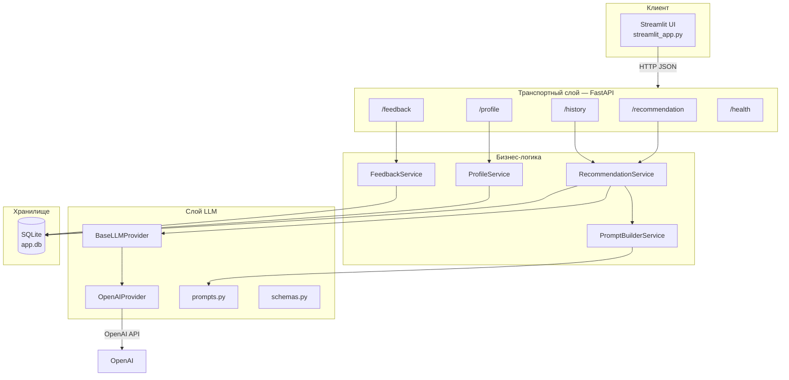
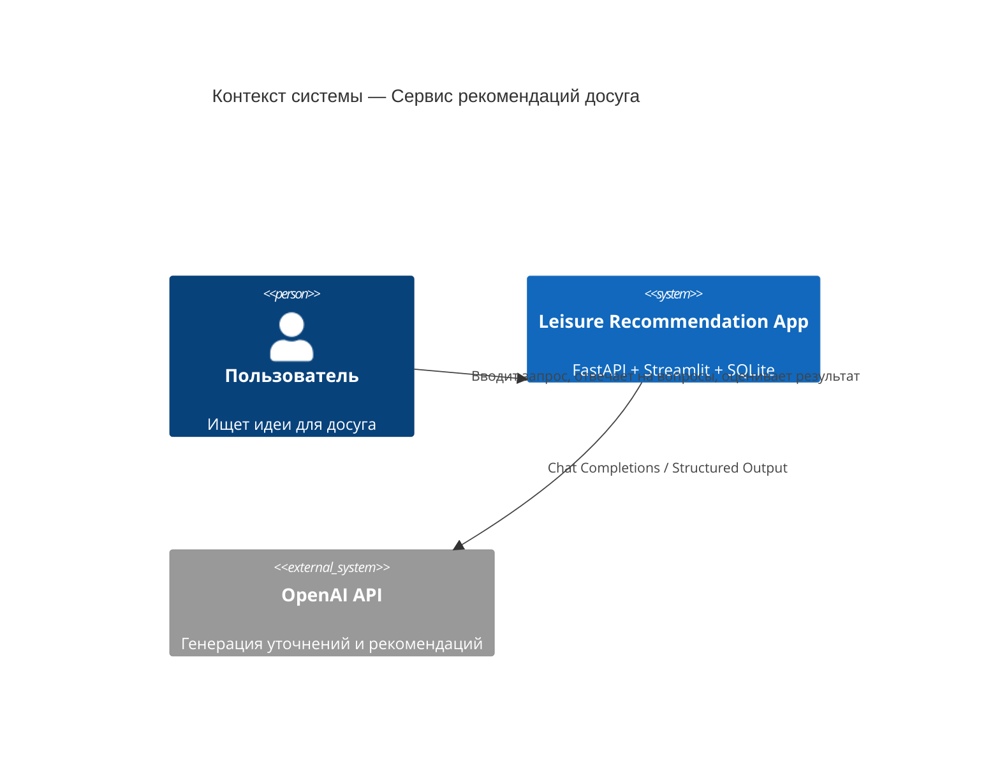
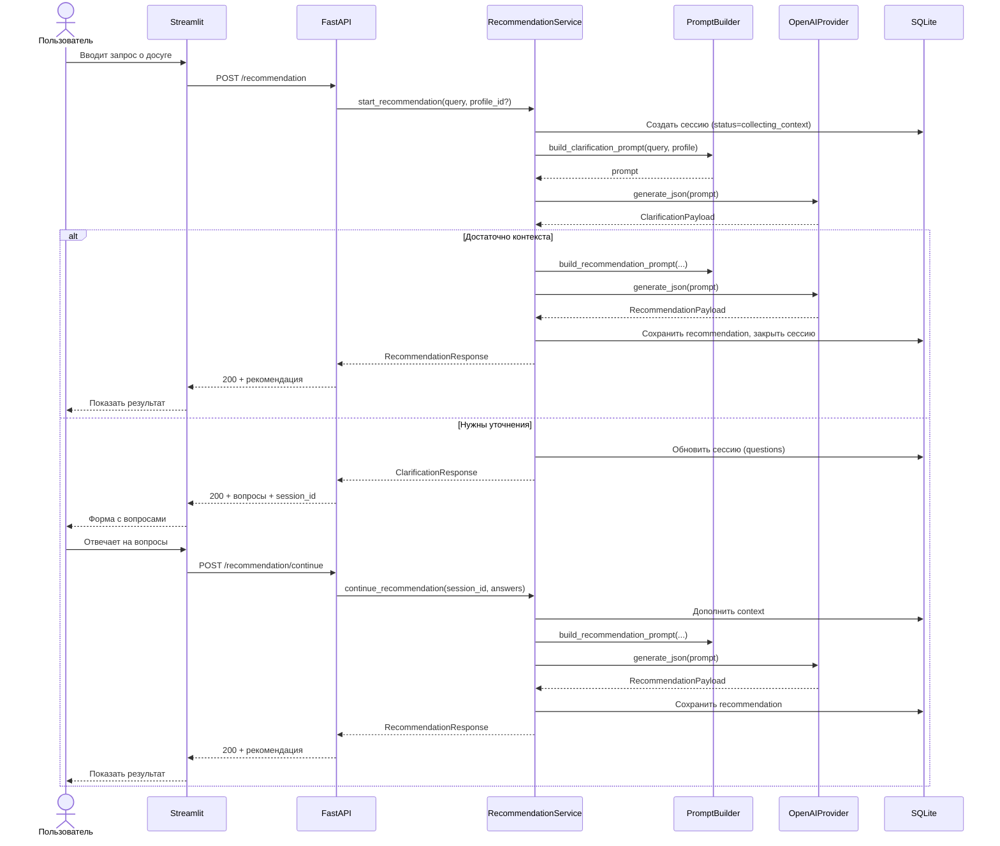
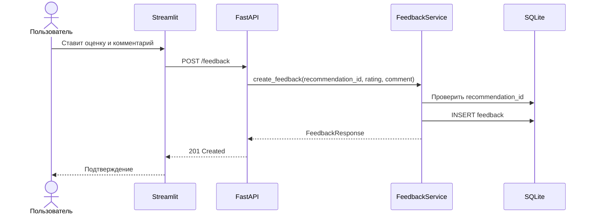
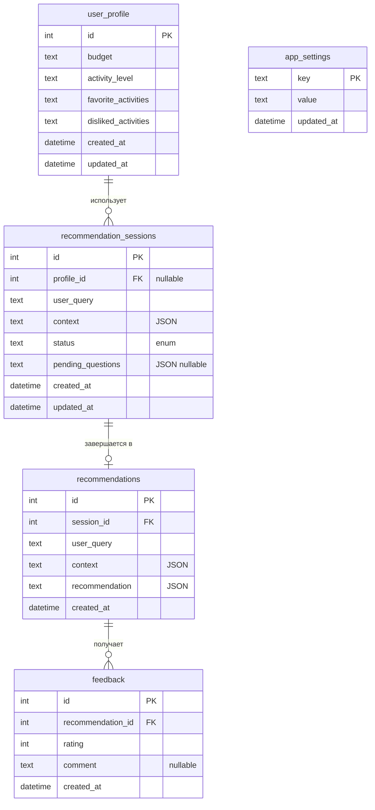
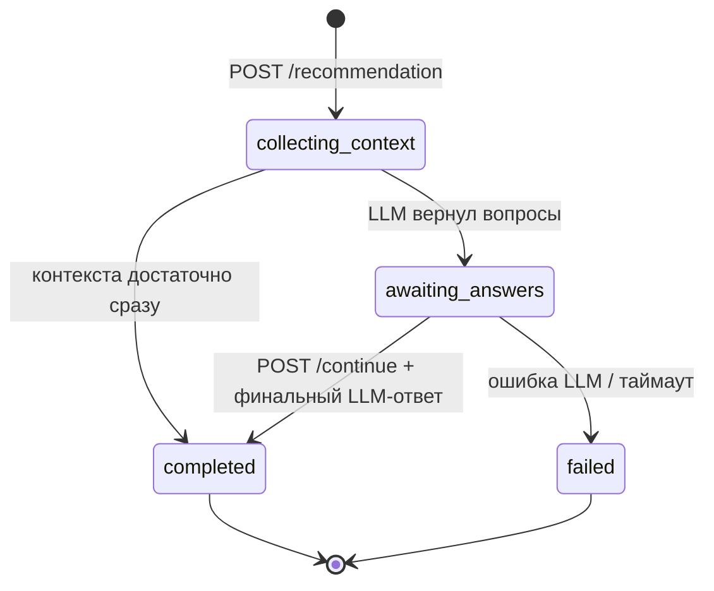
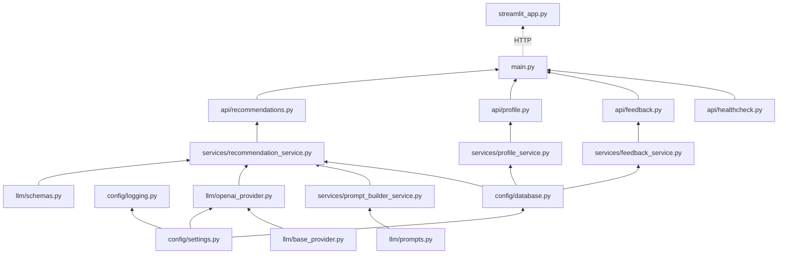

# Архитектура

## Обзор системы



## Слои и ответственность

### `api/` — транспортный слой

- Приём HTTP-запросов, возврат HTTP-ответов.
- Валидация входа через Pydantic.
- Делегирование сервисам.
- Преобразование доменных исключений в HTTP-коды.

**Не делает:** вызовов OpenAI, сборки промптов, прямых SQL-запросов (кроме DI сессии БД).

### `services/` — бизнес-логика

| Сервис | Задачи |
|--------|--------|
| `RecommendationService` | Анализ запроса, оркестрация уточнений, вызов LLM, сохранение истории |
| `PromptBuilderService` | Сборка system/user-промптов из шаблонов и контекста |
| `ProfileService` | CRUD профиля пользователя (бюджет, активность, предпочтения) |
| `FeedbackService` | Сохранение оценок и комментариев к рекомендациям |

**Не делает:** работы с HTTP, чтения `.env` напрямую, импорта FastAPI.

### `llm/` — интеграция с языковой моделью

| Модуль | Назначение |
|--------|------------|
| `base_provider.py` | Абстрактный интерфейс `generate()` / `generate_json()` |
| `openai_provider.py` | Реализация через OpenAI SDK |
| `prompts.py` | `SYSTEM_PROMPT`, `CLARIFICATION_PROMPT`, `RECOMMENDATION_PROMPT` |
| `schemas.py` | Pydantic-схемы ответов LLM (`ClarificationPayload`, `RecommendationPayload`) |

### `config/` — конфигурация

- `settings.py` — `pydantic-settings`, переменные из `.env`.
- `database.py` — engine, session factory, инициализация таблиц.
- `logging.py` — уровни INFO / WARNING / ERROR.

### `streamlit_app.py` — интерфейс

- Многошаговая форма: запрос → уточнения → результат.
- HTTP-клиент (`httpx`) к FastAPI.
- Страницы/секции: новая рекомендация, история, профиль, обратная связь.

## Диаграмма компонентов



## Sequence: получение рекомендации



## Sequence: обратная связь



## ER-диаграмма SQLite



> Таблица `recommendation_sessions` добавлена для многошагового сценария (уточняющие вопросы). В исходном ТЗ контекст хранился только в `recommendations`; для MVP сессия — промежуточное состояние до финального ответа.

## State machine сессии рекомендации



## Зависимости между модулями



Направление импортов — только вниз по цепочке. `llm/` не импортирует `api/` или `streamlit_app.py`.

## Обработка ошибок

| Ситуация | Слой | HTTP-код |
|----------|------|----------|
| Невалидное тело запроса | FastAPI / Pydantic | `422` |
| Сессия не найдена / истекла | `RecommendationService` | `404` |
| Рекомендация не найдена (feedback) | `FeedbackService` | `404` |
| Невалидный JSON от LLM | `llm/openai_provider` | `502` |
| Таймаут / ошибка OpenAI API | `llm/openai_provider` | `502` |
| Нарушение бизнес-правил (дубль feedback) | `FeedbackService` | `409` |
| Неожиданная ошибка | любой | `500` |

## Переменные окружения

```env
# OpenAI
OPENAI_API_KEY=sk-...
MODEL_NAME=gpt-4o-mini
OPENAI_TIMEOUT_SECONDS=60

# База данных
DATABASE_URL=sqlite:///./app.db

# API
API_HOST=0.0.0.0
API_PORT=8000

# Streamlit → API
API_BASE_URL=http://localhost:8000

# Лимиты
MAX_USER_QUERY_LENGTH=1000
MAX_CLARIFICATION_ROUNDS=2
SESSION_TTL_HOURS=24
```

## Технологический стек

| Компонент | Библиотека |
|-----------|------------|
| API | FastAPI, Uvicorn |
| Валидация / настройки | Pydantic v2, pydantic-settings |
| ORM (опционально) | SQLAlchemy 2.x |
| LLM | openai (официальный SDK) |
| UI | Streamlit |
| HTTP-клиент (UI, тесты) | httpx |
| Тесты | pytest, pytest-asyncio |

## Исключённые технологии (MVP)

Redis, PostgreSQL, Docker, Kubernetes, Prometheus, Grafana — не используются на этапе MVP для снижения сложности инфраструктуры.
