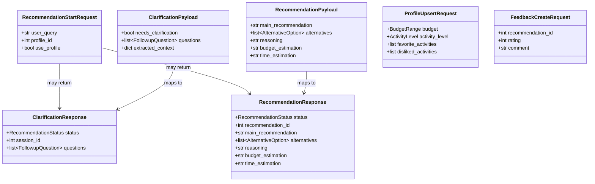

# Модели и типы данных

Все API-модели — **Pydantic v2**. Размещение:

| Слой | Файл |
|------|------|
| REST API (вход/выход) | `api/schemas.py` |
| Ответы LLM | `llm/schemas.py` |
| Таблицы SQLite | `db/models.py` (SQLAlchemy) или миграции в `config/database.py` |

---

## Enum-типы

### `ActivityLevel` — уровень активности

```python
from enum import Enum


class ActivityLevel(str, Enum):
    LOW = "low"           # Спокойный отдых: кино, кафе, чтение
    MODERATE = "moderate" # Прогулки, музеи, несложные активности
    HIGH = "high"         # Спорт, походы, активные развлечения
```

### `BudgetRange` — бюджет (профиль и контекст)

```python
class BudgetRange(str, Enum):
    FREE = "free"           # Бесплатно / минимальные расходы
    LOW = "low"             # До 2 000 ₽
    MEDIUM = "medium"       # 2 000–10 000 ₽
    HIGH = "high"           # Более 10 000 ₽
    FLEXIBLE = "flexible"   # Бюджет не важен
```

### `SessionStatus` — статус сессии рекомендации

```python
class SessionStatus(str, Enum):
    COLLECTING_CONTEXT = "collecting_context"  # Первичный анализ
    AWAITING_ANSWERS = "awaiting_answers"      # Ожидание ответов пользователя
    COMPLETED = "completed"                    # Рекомендация выдана
    FAILED = "failed"                          # Ошибка LLM / таймаут
    EXPIRED = "expired"                        # Превышен TTL сессии
```

### `RecommendationStatus` — тип ответа API на шаге рекомендации

```python
class RecommendationStatus(str, Enum):
    NEEDS_CLARIFICATION = "needs_clarification"  # Нужны уточнения
    COMPLETED = "completed"                      # Финальная рекомендация
```

---

## Входные модели API

### `RecommendationStartRequest` — начало сценария

```python
from pydantic import BaseModel, Field, field_validator


class RecommendationStartRequest(BaseModel):
    user_query: str = Field(
        ...,
        min_length=5,
        max_length=1000,
        description="Описание ситуации, например: «Не знаю, как провести субботу»",
        examples=["Не знаю, как провести субботу в Москве"],
    )
    profile_id: int | None = Field(
        default=None,
        ge=1,
        description="ID сохранённого профиля для персонализации",
    )
    use_profile: bool = Field(
        default=True,
        description="Учитывать профиль при формировании промпта",
    )

    @field_validator("user_query")
    @classmethod
    def normalize_query(cls, v: str) -> str:
        v = " ".join(v.split())
        if len(v) < 5:
            raise ValueError("Запрос слишком короткий — опишите ситуацию подробнее")
        return v
```

### `ClarificationAnswer` — ответ на один уточняющий вопрос

```python
class ClarificationAnswer(BaseModel):
    question_id: str = Field(..., min_length=1, max_length=50)
    answer: str = Field(..., min_length=1, max_length=500)
```

### `RecommendationContinueRequest` — продолжение после уточнений

```python
class RecommendationContinueRequest(BaseModel):
    session_id: int = Field(..., ge=1)
    answers: list[ClarificationAnswer] = Field(
        ...,
        min_length=1,
        max_length=10,
    )
```

### `ProfileUpsertRequest` — создание/обновление профиля

```python
class ProfileUpsertRequest(BaseModel):
    budget: BudgetRange | None = None
    activity_level: ActivityLevel | None = None
    favorite_activities: list[str] = Field(default_factory=list, max_length=20)
    disliked_activities: list[str] = Field(default_factory=list, max_length=20)

    @field_validator("favorite_activities", "disliked_activities")
    @classmethod
    def normalize_activities(cls, v: list[str]) -> list[str]:
        normalized = []
        for item in v:
            item = item.strip()
            if item and item not in normalized:
                normalized.append(item)
        return normalized[:20]
```

### `FeedbackCreateRequest`

```python
class FeedbackCreateRequest(BaseModel):
    recommendation_id: int = Field(..., ge=1)
    rating: int = Field(..., ge=1, le=5, description="Оценка от 1 до 5")
    comment: str | None = Field(default=None, max_length=1000)
```

### `HistoryQueryParams` — query-параметры `GET /history`

```python
class HistoryQueryParams(BaseModel):
    limit: int = Field(default=20, ge=1, le=100)
    offset: int = Field(default=0, ge=0)
```

---

## Модели ответа LLM (`llm/schemas.py`)

### `FollowupQuestion` — уточняющий вопрос от LLM

```python
class FollowupQuestion(BaseModel):
    id: str = Field(..., min_length=1, max_length=50)
    text: str = Field(..., min_length=5, max_length=300)
    hint: str | None = Field(default=None, max_length=200)
```

### `ClarificationPayload` — ответ LLM на этапе уточнения

```python
class ClarificationPayload(BaseModel):
    needs_clarification: bool
    questions: list[FollowupQuestion] = Field(default_factory=list)
    extracted_context: dict[str, str] = Field(default_factory=dict)

    @field_validator("questions")
    @classmethod
    def validate_questions_consistency(
        cls, v: list[FollowupQuestion], info
    ) -> list[FollowupQuestion]:
        needs = info.data.get("needs_clarification")
        if needs and not v:
            raise ValueError("При needs_clarification=true нужен хотя бы один вопрос")
        if not needs and v:
            raise ValueError("При needs_clarification=false список questions должен быть пустым")
        if needs and len(v) > 5:
            raise ValueError("Не более 5 уточняющих вопросов за раунд")
        return v
```

### `AlternativeOption` — альтернативный вариант досуга

```python
class AlternativeOption(BaseModel):
    title: str = Field(..., min_length=2, max_length=150)
    description: str = Field(..., min_length=10, max_length=500)
    budget_estimation: str = Field(..., min_length=2, max_length=100)
    time_estimation: str = Field(..., min_length=2, max_length=100)
```

### `RecommendationPayload` — финальный ответ LLM

```python
class RecommendationPayload(BaseModel):
    main_recommendation: str = Field(..., min_length=10, max_length=1000)
    alternatives: list[AlternativeOption] = Field(default_factory=list, max_length=5)
    reasoning: str = Field(..., min_length=10, max_length=1500)
    budget_estimation: str = Field(..., min_length=2, max_length=100)
    time_estimation: str = Field(..., min_length=2, max_length=100)

    @field_validator("alternatives")
    @classmethod
    def validate_alternatives_count(cls, v: list[AlternativeOption]) -> list[AlternativeOption]:
        if len(v) > 5:
            raise ValueError("Не более 5 альтернатив")
        return v
```

---

## Выходные модели API

### `ClarificationResponse`

```python
class ClarificationResponse(BaseModel):
    status: RecommendationStatus = RecommendationStatus.NEEDS_CLARIFICATION
    session_id: int
    questions: list[FollowupQuestion]
    message: str | None = Field(
        default=None,
        description="Пояснение от сервиса, зачем нужны уточнения",
    )
```

### `RecommendationResponse`

```python
class RecommendationResponse(BaseModel):
    status: RecommendationStatus = RecommendationStatus.COMPLETED
    recommendation_id: int
    session_id: int
    user_query: str
    main_recommendation: str
    alternatives: list[AlternativeOption]
    reasoning: str
    budget_estimation: str
    time_estimation: str
    created_at: datetime
```

### `ProfileResponse`

```python
class ProfileResponse(BaseModel):
    id: int
    budget: BudgetRange | None
    activity_level: ActivityLevel | None
    favorite_activities: list[str]
    disliked_activities: list[str]
    created_at: datetime
    updated_at: datetime
```

### `HistoryItem`

```python
class HistoryItem(BaseModel):
    id: int
    user_query: str
    main_recommendation: str
    budget_estimation: str
    time_estimation: str
    created_at: datetime
    has_feedback: bool
```

### `HistoryResponse`

```python
class HistoryResponse(BaseModel):
    items: list[HistoryItem]
    total: int
    limit: int
    offset: int
```

### `FeedbackResponse`

```python
class FeedbackResponse(BaseModel):
    id: int
    recommendation_id: int
    rating: int
    comment: str | None
    created_at: datetime
```

### `ErrorResponse`

```python
class ErrorResponse(BaseModel):
    detail: str
    error_code: str | None = None
```

---

## Union-тип ответа рекомендации

```python
RecommendationStartResponse = ClarificationResponse | RecommendationResponse
RecommendationContinueResponse = RecommendationResponse
```

---

## Схема SQLite

### `user_profile`

| Колонка | Тип | Ограничения |
|---------|-----|-------------|
| `id` | INTEGER | PRIMARY KEY AUTOINCREMENT |
| `budget` | TEXT | nullable, значения `BudgetRange` |
| `activity_level` | TEXT | nullable, значения `ActivityLevel` |
| `favorite_activities` | TEXT | JSON-массив строк |
| `disliked_activities` | TEXT | JSON-массив строк |
| `created_at` | DATETIME | NOT NULL, DEFAULT CURRENT_TIMESTAMP |
| `updated_at` | DATETIME | NOT NULL |

### `recommendation_sessions`

| Колонка | Тип | Ограничения |
|---------|-----|-------------|
| `id` | INTEGER | PRIMARY KEY AUTOINCREMENT |
| `profile_id` | INTEGER | FK → `user_profile.id`, nullable |
| `user_query` | TEXT | NOT NULL, ≤ 1000 символов |
| `context` | TEXT | JSON-объект накопленного контекста |
| `status` | TEXT | NOT NULL, `SessionStatus` |
| `pending_questions` | TEXT | JSON-массив `FollowupQuestion`, nullable |
| `clarification_rounds` | INTEGER | DEFAULT 0, ≤ 2 |
| `created_at` | DATETIME | NOT NULL |
| `updated_at` | DATETIME | NOT NULL |

### `recommendations`

| Колонка | Тип | Ограничения |
|---------|-----|-------------|
| `id` | INTEGER | PRIMARY KEY AUTOINCREMENT |
| `session_id` | INTEGER | FK → `recommendation_sessions.id`, UNIQUE |
| `user_query` | TEXT | NOT NULL |
| `context` | TEXT | JSON итогового контекста |
| `recommendation` | TEXT | JSON `RecommendationPayload` |
| `created_at` | DATETIME | NOT NULL |

### `feedback`

| Колонка | Тип | Ограничения |
|---------|-----|-------------|
| `id` | INTEGER | PRIMARY KEY AUTOINCREMENT |
| `recommendation_id` | INTEGER | FK → `recommendations.id`, UNIQUE |
| `rating` | INTEGER | NOT NULL, 1–5 |
| `comment` | TEXT | nullable, ≤ 1000 символов |
| `created_at` | DATETIME | NOT NULL |

### `app_settings`

| Колонка | Тип | Ограничения |
|---------|-----|-------------|
| `key` | TEXT | PRIMARY KEY |
| `value` | TEXT | NOT NULL |
| `updated_at` | DATETIME | NOT NULL |

---

## SQL DDL (справочно)

```sql
CREATE TABLE user_profile (
    id INTEGER PRIMARY KEY AUTOINCREMENT,
    budget TEXT,
    activity_level TEXT,
    favorite_activities TEXT NOT NULL DEFAULT '[]',
    disliked_activities TEXT NOT NULL DEFAULT '[]',
    created_at DATETIME NOT NULL DEFAULT CURRENT_TIMESTAMP,
    updated_at DATETIME NOT NULL DEFAULT CURRENT_TIMESTAMP
);

CREATE TABLE recommendation_sessions (
    id INTEGER PRIMARY KEY AUTOINCREMENT,
    profile_id INTEGER REFERENCES user_profile(id),
    user_query TEXT NOT NULL,
    context TEXT NOT NULL DEFAULT '{}',
    status TEXT NOT NULL,
    pending_questions TEXT,
    clarification_rounds INTEGER NOT NULL DEFAULT 0,
    created_at DATETIME NOT NULL DEFAULT CURRENT_TIMESTAMP,
    updated_at DATETIME NOT NULL DEFAULT CURRENT_TIMESTAMP
);

CREATE TABLE recommendations (
    id INTEGER PRIMARY KEY AUTOINCREMENT,
    session_id INTEGER NOT NULL UNIQUE REFERENCES recommendation_sessions(id),
    user_query TEXT NOT NULL,
    context TEXT NOT NULL DEFAULT '{}',
    recommendation TEXT NOT NULL,
    created_at DATETIME NOT NULL DEFAULT CURRENT_TIMESTAMP
);

CREATE TABLE feedback (
    id INTEGER PRIMARY KEY AUTOINCREMENT,
    recommendation_id INTEGER NOT NULL UNIQUE REFERENCES recommendations(id),
    rating INTEGER NOT NULL CHECK (rating BETWEEN 1 AND 5),
    comment TEXT,
    created_at DATETIME NOT NULL DEFAULT CURRENT_TIMESTAMP
);

CREATE TABLE app_settings (
    key TEXT PRIMARY KEY,
    value TEXT NOT NULL,
    updated_at DATETIME NOT NULL DEFAULT CURRENT_TIMESTAMP
);
```

---

## Маппинг LLM → API

```python
def to_recommendation_response(
    payload: RecommendationPayload,
    *,
    recommendation_id: int,
    session_id: int,
    user_query: str,
    created_at: datetime,
) -> RecommendationResponse:
    return RecommendationResponse(
        recommendation_id=recommendation_id,
        session_id=session_id,
        user_query=user_query,
        main_recommendation=payload.main_recommendation,
        alternatives=payload.alternatives,
        reasoning=payload.reasoning,
        budget_estimation=payload.budget_estimation,
        time_estimation=payload.time_estimation,
        created_at=created_at,
    )
```

---

## JSON в колонках SQLite

| Колонка | Формат | Пример |
|---------|--------|--------|
| `context` | `dict[str, str]` | `{"budget": "medium", "company": "alone"}` |
| `pending_questions` | `list[FollowupQuestion]` | `[{"id": "budget", "text": "Какой бюджет?"}]` |
| `recommendation` | `RecommendationPayload` | полный JSON финального ответа |
| `favorite_activities` | `list[str]` | `["кино", "прогулки"]` |

При чтении из БД — `json.loads()` + валидация через Pydantic.

---

## Диаграмма классов (доменные модели)


