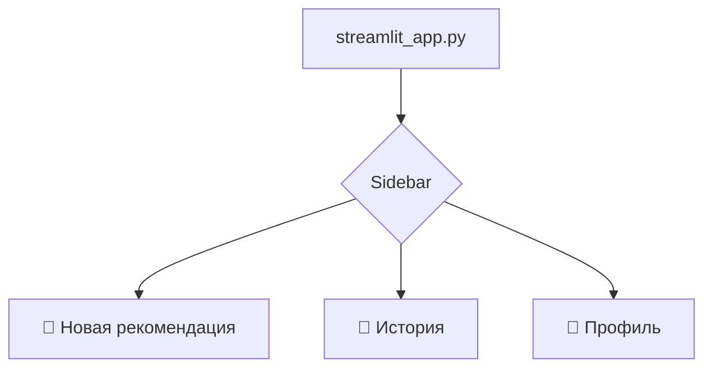
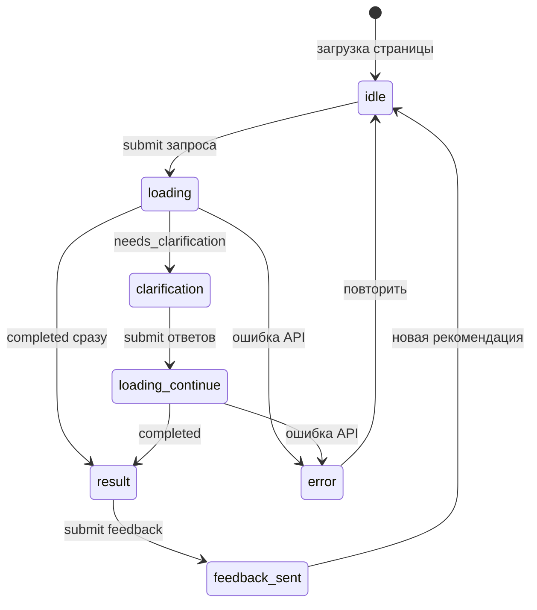
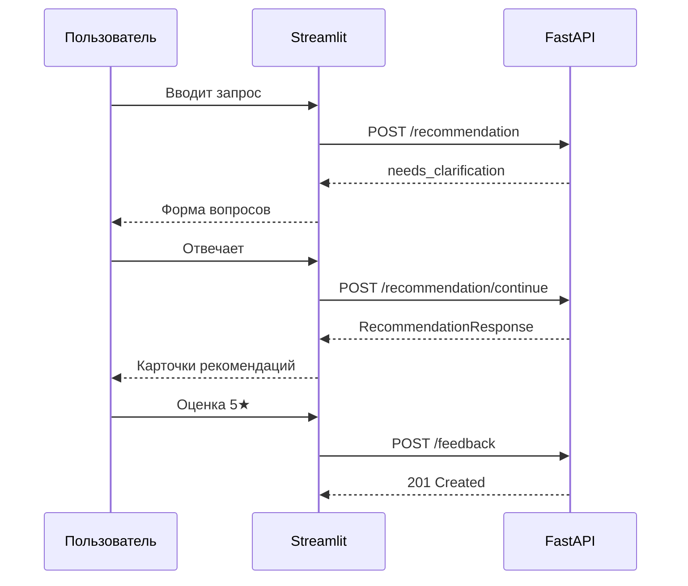

# Streamlit-интерфейс

## Назначение

Веб-интерфейс для получения рекомендаций досуга, просмотра истории и оценки результатов. **Не импортирует** бизнес-логику — общается с FastAPI по HTTP (`httpx`).

Файл: `streamlit_app.py` (или `ui/app.py` при разделении на модули).

---

## Навигация



| Страница | API-вызовы |
|----------|------------|
| Новая рекомендация | `POST /recommendation`, `POST /recommendation/continue`, `POST /feedback` |
| История | `GET /history`, `GET /history/{id}` |
| Профиль | `GET /profile`, `PUT /profile` |

---

## Макет: новая рекомендация

### Шаг 1 — ввод запроса

```
┌─────────────────────────────────────────────────────────────┐
│  🎯 Как провести время?                                     │
├─────────────────────────────────────────────────────────────┤
│                                                             │
│  Опишите ситуацию *                                         │
│  ┌─────────────────────────────────────────────────────┐   │
│  │ Не знаю, как провести субботу в Москве              │   │
│  └─────────────────────────────────────────────────────┘   │
│                                                             │
│  ☑ Учитывать мой профиль                                    │
│                                                             │
│              [ ✨ Получить рекомендацию ]                   │
│                                                             │
└─────────────────────────────────────────────────────────────┘
```

### Шаг 2 — уточняющие вопросы

```
┌─────────────────────────────────────────────────────────────┐
│  💬 Уточним детали                                          │
├─────────────────────────────────────────────────────────────┤
│                                                             │
│  Какой у вас примерный бюджет на день?                      │
│  [ До 5000 ₽                                          ]     │
│  💡 Например: до 3000 ₽ или бесплатно                       │
│                                                             │
│  Планируете провести время один или с компанией?            │
│  [ С другом                                            ]    │
│                                                             │
│  Предпочитаете спокойный или активный отдых?               │
│  ○ Спокойный  ● Умеренный  ○ Активный                       │
│                                                             │
│              [ ➡️ Продолжить ]                              │
│                                                             │
└─────────────────────────────────────────────────────────────┘
```

### Шаг 3 — результат

```
┌─────────────────────────────────────────────────────────────┐
│  ✅ Ваша рекомендация                                       │
├─────────────────────────────────────────────────────────────┤
│                                                             │
│  🌟 Основной вариант                                        │
│  ┌─────────────────────────────────────────────────────┐   │
│  │ Прогулка по парку Горького с остановкой в кафе...   │   │
│  │ 💰 2000–5000 ₽    ⏱ 4–6 часов                      │   │
│  └─────────────────────────────────────────────────────┘   │
│                                                             │
│  💡 Почему этот вариант                                     │
│  Учитывая бюджет и желание умеренной активности...          │
│                                                             │
│  🔄 Альтернативы                                            │
│  ┌─ Поход в музей ────────────────────────────────────┐   │
│  │ ...                                                 │   │
│  └─────────────────────────────────────────────────────┘   │
│                                                             │
│  ── Оцените рекомендацию ──                                 │
│  Оценка: ★★★★★  [slider 1–5]                               │
│  Комментарий: [ необязательно                         ]     │
│  [ 📤 Отправить отзыв ]                                     │
│                                                             │
└─────────────────────────────────────────────────────────────┘
```

---

## Состояние сессии (`st.session_state`)



| Ключ | Тип | Назначение |
|------|-----|------------|
| `step` | `str` | `input` \| `clarification` \| `result` \| `error` |
| `session_id` | `int \| None` | ID сессии для `continue` |
| `questions` | `list[dict] \| None` | Уточняющие вопросы |
| `recommendation` | `dict \| None` | Финальный ответ |
| `recommendation_id` | `int \| None` | Для feedback |
| `feedback_submitted` | `bool` | Блокировка повторной отправки |

---

## Реализация (скелет)

```python
# streamlit_app.py

import os
import httpx
import streamlit as st

API_BASE_URL = os.getenv("API_BASE_URL", "http://localhost:8000")

BUDGET_OPTIONS = {
    "Бесплатно": "free",
    "До 2 000 ₽": "low",
    "2 000–10 000 ₽": "medium",
    "Более 10 000 ₽": "high",
    "Не важно": "flexible",
}

ACTIVITY_OPTIONS = {
    "Спокойный": "low",
    "Умеренный": "moderate",
    "Активный": "high",
}


def api_request(method: str, path: str, **kwargs) -> httpx.Response | None:
    try:
        return httpx.request(method, f"{API_BASE_URL}{path}", timeout=60.0, **kwargs)
    except httpx.ConnectError:
        st.error("Не удалось подключиться к API. Запустите: `uvicorn main:app --reload`")
        return None
    except httpx.TimeoutException:
        st.error("Превышено время ожидания. Попробуйте позже.")
        return None


def init_state() -> None:
    defaults = {
        "step": "input",
        "session_id": None,
        "questions": None,
        "recommendation": None,
        "recommendation_id": None,
        "feedback_submitted": False,
    }
    for key, value in defaults.items():
        if key not in st.session_state:
            st.session_state[key] = value


def render_input_step() -> None:
    st.subheader("Опишите ситуацию")
    with st.form("query_form"):
        user_query = st.text_area(
            "Что хотите сделать?",
            placeholder="Например: Не знаю, как провести субботу",
            height=100,
        )
        use_profile = st.checkbox("Учитывать мой профиль", value=True)
        submitted = st.form_submit_button("✨ Получить рекомендацию", type="primary")

    if not submitted:
        return
    if not user_query or not user_query.strip():
        st.error("Опишите ситуацию — минимум несколько слов")
        return

    with st.spinner("Анализируем ваш запрос..."):
        response = api_request(
            "POST",
            "/recommendation",
            json={"user_query": user_query.strip(), "use_profile": use_profile},
        )
    if response is None:
        return
    if response.status_code != 200:
        st.error(response.json().get("detail", "Ошибка сервера"))
        return

    data = response.json()
    if data["status"] == "needs_clarification":
        st.session_state.step = "clarification"
        st.session_state.session_id = data["session_id"]
        st.session_state.questions = data["questions"]
    else:
        st.session_state.step = "result"
        st.session_state.recommendation = data
        st.session_state.recommendation_id = data["recommendation_id"]
    st.rerun()


def render_clarification_step() -> None:
    st.subheader("💬 Уточним детали")
    questions = st.session_state.questions or []

    with st.form("clarification_form"):
        answers = []
        for q in questions:
            st.markdown(f"**{q['text']}**")
            if q.get("hint"):
                st.caption(f"💡 {q['hint']}")
            answer = st.text_input(f"answer_{q['id']}", label_visibility="collapsed")
            answers.append({"question_id": q["id"], "answer": answer})
        submitted = st.form_submit_button("➡️ Продолжить", type="primary")

    if not submitted:
        return
    for a in answers:
        if not a["answer"].strip():
            st.error("Ответьте на все вопросы")
            return

    payload = {
        "session_id": st.session_state.session_id,
        "answers": [{**a, "answer": a["answer"].strip()} for a in answers],
    }
    with st.spinner("Формируем рекомендацию..."):
        response = api_request("POST", "/recommendation/continue", json=payload)
    if response is None or response.status_code != 200:
        if response:
            st.error(response.json().get("detail", "Ошибка"))
        return

    st.session_state.step = "result"
    st.session_state.recommendation = response.json()
    st.session_state.recommendation_id = response.json()["recommendation_id"]
    st.rerun()


def render_result_step() -> None:
    data = st.session_state.recommendation
    if not data:
        return

    st.subheader("✅ Ваша рекомендация")
    with st.container(border=True):
        st.markdown(f"### 🌟 {data['main_recommendation']}")
        col1, col2 = st.columns(2)
        col1.caption(f"💰 {data['budget_estimation']}")
        col2.caption(f"⏱ {data['time_estimation']}")

    st.info(f"**Почему этот вариант:** {data['reasoning']}")

    if data.get("alternatives"):
        st.markdown("### 🔄 Альтернативы")
        for alt in data["alternatives"]:
            with st.container(border=True):
                st.markdown(f"**{alt['title']}**")
                st.write(alt["description"])
                st.caption(f"💰 {alt['budget_estimation']}  ·  ⏱ {alt['time_estimation']}")

    if not st.session_state.feedback_submitted:
        st.divider()
        st.markdown("### Оцените рекомендацию")
        with st.form("feedback_form"):
            rating = st.slider("Оценка", 1, 5, 5)
            comment = st.text_area("Комментарий (необязательно)", max_chars=1000)
            if st.form_submit_button("📤 Отправить отзыв"):
                resp = api_request(
                    "POST",
                    "/feedback",
                    json={
                        "recommendation_id": st.session_state.recommendation_id,
                        "rating": rating,
                        "comment": comment.strip() or None,
                    },
                )
                if resp and resp.status_code == 201:
                    st.session_state.feedback_submitted = True
                    st.success("Спасибо за отзыв!")
                    st.rerun()

    if st.button("🔄 Новая рекомендация"):
        for key in list(st.session_state.keys()):
            del st.session_state[key]
        st.rerun()


def render_history_page() -> None:
    st.header("📜 История рекомендаций")
    response = api_request("GET", "/history?limit=20")
    if response is None or response.status_code != 200:
        return
    data = response.json()
    if not data["items"]:
        st.info("Пока нет сохранённых рекомендаций")
        return
    for item in data["items"]:
        with st.expander(f"{item['created_at'][:10]} — {item['user_query'][:60]}..."):
            st.write(item["main_recommendation"])
            st.caption(f"💰 {item['budget_estimation']}  ·  ⏱ {item['time_estimation']}")
            if item["has_feedback"]:
                st.caption("✅ Оценка оставлена")


def render_profile_page() -> None:
    st.header("👤 Профиль")
    response = api_request("GET", "/profile")
    profile = response.json() if response and response.status_code == 200 else {}

    with st.form("profile_form"):
        budget_label = st.selectbox(
            "Бюджет",
            options=list(BUDGET_OPTIONS.keys()),
            index=2,
        )
        activity_label = st.selectbox(
            "Уровень активности",
            options=list(ACTIVITY_OPTIONS.keys()),
            index=1,
        )
        favorites = st.text_area(
            "Любимые занятия (через запятую)",
            value=", ".join(profile.get("favorite_activities", [])),
        )
        disliked = st.text_area(
            "Не нравится (через запятую)",
            value=", ".join(profile.get("disliked_activities", [])),
        )
        if st.form_submit_button("💾 Сохранить профиль"):
            payload = {
                "budget": BUDGET_OPTIONS[budget_label],
                "activity_level": ACTIVITY_OPTIONS[activity_label],
                "favorite_activities": [x.strip() for x in favorites.split(",") if x.strip()],
                "disliked_activities": [x.strip() for x in disliked.split(",") if x.strip()],
            }
            resp = api_request("PUT", "/profile", json=payload)
            if resp and resp.status_code == 200:
                st.success("Профиль сохранён")


def main() -> None:
    st.set_page_config(
        page_title="Рекомендации досуга",
        page_icon="🎯",
        layout="centered",
    )
    init_state()

    st.title("🎯 Как провести время?")
    st.caption("Опишите ситуацию — AI подберёт идеи для досуга с учётом ваших предпочтений.")

    page = st.sidebar.radio(
        "Навигация",
        ["Новая рекомендация", "История", "Профиль"],
    )
    st.sidebar.caption(f"API: {API_BASE_URL}")

    if page == "История":
        render_history_page()
        return
    if page == "Профиль":
        render_profile_page()
        return

    step = st.session_state.step
    if step == "input":
        render_input_step()
    elif step == "clarification":
        render_clarification_step()
    elif step == "result":
        render_result_step()


if __name__ == "__main__":
    main()
```

---

## Запуск

```bash
# Терминал 1 — API
uvicorn main:app --reload --port 8000

# Терминал 2 — UI
API_BASE_URL=http://localhost:8000 streamlit run streamlit_app.py
```

---

## UX-рекомендации

| Элемент | Рекомендация |
|---------|--------------|
| Spinner | На всех LLM-запросах (5–30 сек) |
| Многошаговость | Не сбрасывать форму при `st.rerun()` — хранить состояние в `session_state` |
| Ошибки сети | Явное сообщение «запустите API» |
| Повторный feedback | Блокировать после успешной отправки |
| Sidebar | URL API, ссылка на `/docs` |
| Placeholder | Примеры запросов в `text_area` |

---

## Диаграмма взаимодействия UI ↔ API



---

## Расширения (вне MVP)

- Детальный просмотр истории (`GET /history/{id}`) в expander.
- Экспорт рекомендации в Markdown.
- Тёмная тема через `config.toml`.
- Кнопка «Поделиться» (копирование текста в буфер).
