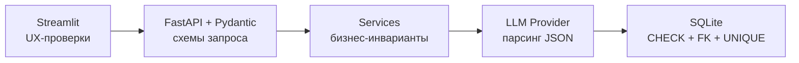
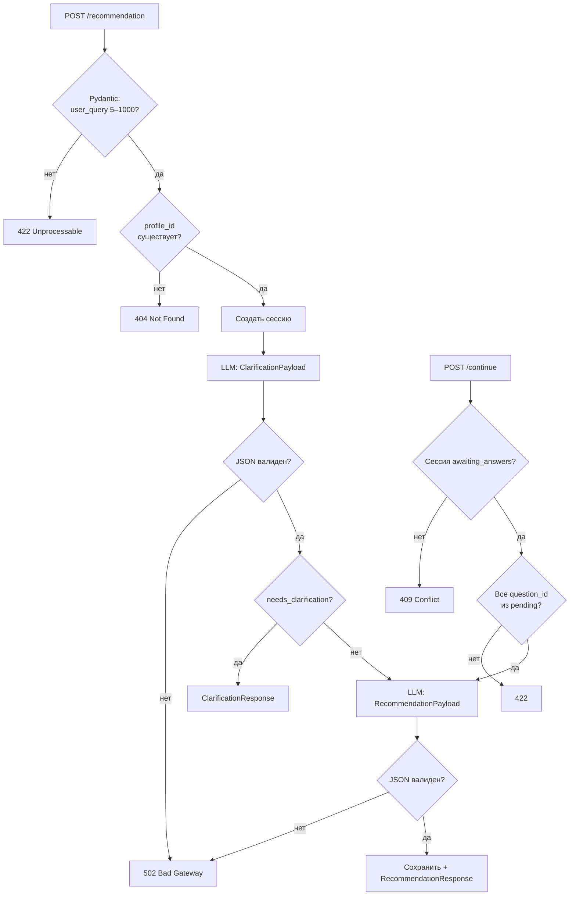

# Ограничения и принципы валидации

Документ описывает правила проверки данных на всех уровнях: API, бизнес-логика, LLM, SQLite, Streamlit.

---

## Принципы

| # | Принцип | Описание |
|---|---------|----------|
| 1 | **Валидация на границе** | Все внешние данные проходят Pydantic при входе в API. Внутренние сервисы доверяют уже провалидированным типам. |
| 2 | **Fail fast** | Некорректный ввод отклоняется до вызова LLM (экономия токенов и времени). |
| 3 | **Двойная проверка LLM** | Сырой ответ модели всегда парсится и валидируется через `ClarificationPayload` / `RecommendationPayload`. |
| 4 | **Нормализация до валидации** | `strip()`, схлопывание пробелов, удаление пустых элементов списков — до проверки длины и формата. |
| 5 | **Явные бизнес-инварианты** | Согласованность полей (например, `needs_clarification` ↔ `questions`) проверяется в `@field_validator` и в сервисах. |
| 6 | **Один feedback на рекомендацию** | Уникальный индекс `feedback.recommendation_id` + проверка в `FeedbackService`. |
| 7 | **Минимальная клиентская валидация** | Streamlit проверяет только очевидные UX-ошибки; источник истины — API. |

---

## Валидация по слоям

---

## API: входные данные

### `POST /recommendation`

| Поле | Ограничение | Нормализация | Сообщение об ошибке |
|------|-------------|--------------|---------------------|
| `user_query` | 5–1000 символов после нормализации | `strip`, схлопнуть пробелы | «Запрос слишком короткий — опишите ситуацию подробнее» |
| `profile_id` | `≥ 1` или `null` | — | Стандартное Pydantic |
| `use_profile` | `bool` | default `true` | — |

**Дополнительно в сервисе:**

- Если `profile_id` указан — профиль должен существовать в БД, иначе `404`.
- Если `use_profile=true` и `profile_id=null` — используется единственный профиль по умолчанию (MVP: создаётся при первом обращении) или профиль игнорируется.

### `POST /recommendation/continue`

| Поле | Ограничение | Нормализация | Сообщение |
|------|-------------|--------------|-----------|
| `session_id` | `≥ 1`, существует в БД | — | «Сессия не найдена» (`404`) |
| `answers` | 1–10 элементов | — | «Укажите хотя бы один ответ» |
| `answers[].question_id` | 1–50 символов | `strip` | — |
| `answers[].answer` | 1–500 символов | `strip` | «Ответ не может быть пустым» |

**Бизнес-правила:**

| Правило | Действие при нарушении |
|---------|------------------------|
| Статус сессии = `awaiting_answers` | Иначе `409` «Сессия не ожидает ответов» |
| `question_id` ∈ `pending_questions` | Иначе `422` «Неизвестный вопрос» |
| Все обязательные вопросы отвечены | Иначе `422` «Ответьте на все вопросы» |
| `clarification_rounds < MAX_CLARIFICATION_ROUNDS` (2) | Иначе принудительная финальная рекомендация без новых вопросов |
| Сессия не старше `SESSION_TTL_HOURS` (24) | Иначе `410` «Сессия истекла» |

### `PUT /profile`

| Поле | Ограничение | Нормализация |
|------|-------------|--------------|
| `budget` | `BudgetRange` enum или `null` | — |
| `activity_level` | `ActivityLevel` enum или `null` | — |
| `favorite_activities` | 0–20 строк, каждая 1–100 символов | `strip`, dedupe, без пустых |
| `disliked_activities` | 0–20 строк, каждая 1–100 символов | `strip`, dedupe, без пустых |

**Инвариант:** активность не может одновременно быть в `favorite` и `disliked` — при пересечении `disliked` имеет приоритет (удаляется из `favorite`).

### `POST /feedback`

| Поле | Ограничение | Нормализация |
|------|-------------|--------------|
| `recommendation_id` | `≥ 1`, существует | — |
| `rating` | целое 1–5 | — |
| `comment` | 0–1000 символов или `null` | `strip`, пустая строка → `null` |

**Бизнес-правила:**

| Правило | HTTP |
|---------|------|
| Рекомендация существует | `404` |
| Feedback ещё не оставлен | `409` |
| `rating` вне 1–5 | `422` |

### `GET /history`

| Параметр | Ограничение | По умолчанию |
|----------|-------------|--------------|
| `limit` | 1–100 | 20 |
| `offset` | `≥ 0` | 0 |

---

## Валидация ответов LLM

### `ClarificationPayload`

| Поле | Правило |
|------|---------|
| `needs_clarification` | `bool`, обязательное |
| `questions` | Если `true` — 1–5 вопросов; если `false` — пустой список |
| `questions[].id` | Уникальные в рамках ответа |
| `questions[].text` | 5–300 символов |
| `extracted_context` | Ключи — строки ≤ 50 символов, значения ≤ 500 символов |

При ошибке парсинга → `LLMParseError` → HTTP `502`.

### `RecommendationPayload`

| Поле | Правило |
|------|---------|
| `main_recommendation` | 10–1000 символов |
| `alternatives` | 0–5 элементов |
| `alternatives[].title` | 2–150 символов |
| `alternatives[].description` | 10–500 символов |
| `budget_estimation` | 2–100 символов, не пустое |
| `time_estimation` | 2–100 символов, не пустое |
| `reasoning` | 10–1500 символов |

**Пост-обработка в сервисе:**

- Если `alternatives` пуст — допустимо (MVP не требует минимум альтернатив).
- Дубликаты `alternatives[].title` — удаляются, остаётся первый.

---

## Валидация при записи в SQLite

| Таблица | Ограничение БД | Доп. проверка в коде |
|---------|----------------|----------------------|
| `feedback.rating` | `CHECK (rating BETWEEN 1 AND 5)` | Pydantic `ge=1, le=5` |
| `feedback.recommendation_id` | `UNIQUE` | проверка перед INSERT |
| `recommendations.session_id` | `UNIQUE` | одна финальная рекомендация на сессию |
| `recommendation_sessions.status` | — | только допустимые значения `SessionStatus` |
| JSON-колонки | — | `json.loads` + Pydantic перед записью |

---

## Диаграмма: поток валидации рекомендации

---

## Коды ошибок (`error_code`)

| Код | HTTP | Когда |
|-----|------|-------|
| `VALIDATION_ERROR` | 422 | Pydantic / бизнес-валидация входа |
| `SESSION_NOT_FOUND` | 404 | Нет сессии с указанным ID |
| `PROFILE_NOT_FOUND` | 404 | Нет профиля |
| `RECOMMENDATION_NOT_FOUND` | 404 | Нет рекомендации (feedback) |
| `SESSION_INVALID_STATE` | 409 | Неверный статус сессии |
| `FEEDBACK_ALREADY_EXISTS` | 409 | Повторная оценка |
| `SESSION_EXPIRED` | 410 | TTL сессии истёк |
| `LLM_PARSE_ERROR` | 502 | Невалидный JSON от модели |
| `LLM_UNAVAILABLE` | 502 | OpenAI timeout / API error |
| `INTERNAL_ERROR` | 500 | Необработанное исключение |

---

## Streamlit: клиентские проверки

| Элемент | Проверка | Примечание |
|---------|----------|------------|
| Поле запроса | не пустое после `strip` | Дублирует API, улучшает UX |
| Ответы на вопросы | все поля заполнены | до отправки `continue` |
| Рейтинг | выбран 1–5 | `st.slider` / `st.radio` |
| Комментарий | ≤ 1000 символов | `max_chars` в `text_area` |
| Сеть | `ConnectError`, `TimeoutException` | понятные сообщения пользователю |

Streamlit **не** дублирует enum-валидацию и FK-проверки — это ответственность API.

---

## Лимиты и конфигурация

Значения задаются в `config/settings.py` и могут переопределяться через `.env`:

| Параметр | Значение по умолчанию | Назначение |
|----------|----------------------|------------|
| `MAX_USER_QUERY_LENGTH` | 1000 | Верхняя граница запроса |
| `MIN_USER_QUERY_LENGTH` | 5 | Нижняя граница запроса |
| `MAX_CLARIFICATION_ROUNDS` | 2 | Макс. раундов уточнений |
| `MAX_QUESTIONS_PER_ROUND` | 5 | Вопросов за один раунд |
| `MAX_ALTERNATIVES` | 5 | Альтернатив в ответе |
| `SESSION_TTL_HOURS` | 24 | Время жизни незавершённой сессии |
| `OPENAI_TIMEOUT_SECONDS` | 60 | Таймаут вызова LLM |
| `HISTORY_DEFAULT_LIMIT` | 20 | Пагинация истории |

---

## Тестирование валидации

### Unit-тесты

- Pydantic-модели: граничные значения, нормализация, инварианты `ClarificationPayload` / `RecommendationPayload`.
- `PromptBuilderService`: корректная подстановка контекста.
- Мок `OpenAIProvider`: невалидный JSON → `LLMParseError`.

### Интеграционные тесты

- `POST /recommendation` с коротким запросом → `422`.
- `POST /continue` с несуществующим `session_id` → `404`.
- `POST /feedback` дважды на одну рекомендацию → `409`.
- Полный happy-path: запрос → уточнения → рекомендация → feedback.
