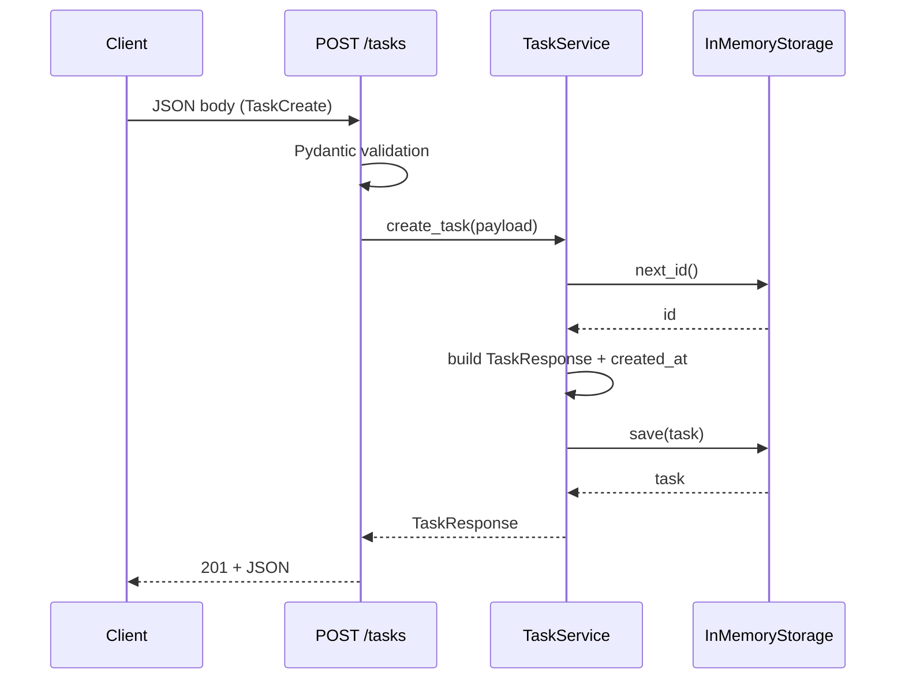

# Архитектура

## Обзор

Проект построен по классической трёхслойной схеме для небольшого FastAPI-приложения:

```
HTTP-запрос
    │
    ▼
┌─────────────────┐
│  api/endpoints  │  Маршрутизация, HTTP-коды, Depends()
└────────┬────────┘
         │
         ▼
┌─────────────────┐
│  services/task  │  Бизнес-логика (ID, created_at)
└────────┬────────┘
         │
         ▼
┌─────────────────┐
│ services/storage│  In-memory dict
└─────────────────┘
```

Слой `api/schemas.py` используется на всех уровнях как единый источник типов данных (DTO и доменная модель ответа совпадают — `TaskResponse`).

## Технологический стек

| Технология | Версия (мин.) | Роль |
|------------|---------------|------|
| **Python** | 3.11+ | Язык реализации |
| **FastAPI** | 0.115+ | ASGI-фреймворк, маршрутизация, OpenAPI, DI |
| **Uvicorn** | 0.32+ | ASGI-сервер для запуска приложения |
| **Pydantic** | 2.9+ | Валидация и сериализация JSON (модели v2) |
| **pydantic-settings** | 2.6+ | Конфигурация из env / `.env` |
| **pytest** | 8.3+ | Тестовый фреймворк |
| **httpx** | 0.28+ | HTTP-клиент (через `TestClient` FastAPI) |

## Слои приложения

### 1. Точка входа (`main.py`)

- Создаёт `FastAPI` с метаданными (title, description, version).
- Подключает `api_router` без глобального префикса — эндпоинты доступны с корня (`/tasks`, `/health`).
- `GET /health` — простой liveness-check, не проходит через сервисный слой.

### 2. API-слой (`api/`)

**`router.py`** — композиция роутеров. Сейчас подключён только `tasks.router`.

**`endpoints/tasks.py`** — тонкие контроллеры:
- Принимают Pydantic-модели из тела запроса.
- Получают `TaskService` через `Depends(get_task_service)`.
- Преобразуют `None` от сервиса в `HTTPException(404)` с типизированным `detail`.

**`schemas.py`** — контракты API. Отдельной ORM/доменной модели нет: `TaskResponse` одновременно служит и внутренним представлением задачи в хранилище.

### 3. Сервисный слой (`services/`)

**`TaskService`** инкапсулирует операции над задачами:
- `create_task` — выделяет ID через storage, ставит `created_at` в UTC, сохраняет.
- `get_task` — проксирует в storage, возвращает `None` если не найдено.
- `list_tasks` — возвращает все значения из storage.

**`get_task_service`** — фабрика для FastAPI Depends. Использует модульный синглтон `_storage`, общий для всего процесса.

### 4. Слой хранения (`services/storage.py`)

**`InMemoryStorage`** — простой репозиторий:
- `_tasks: dict[int, TaskResponse]` — основное хранилище.
- `_next_id` — счётчик для монотонной выдачи ID (1, 2, 3, …).
- Методы: `save`, `get`, `list_all`, `next_id`.

Интерфейс storage не абстрагирован через Protocol/ABC — прямая зависимость от `InMemoryStorage`, что соответствует учебному масштабу проекта.

### 5. Конфигурация (`config/settings.py`)

`Settings` на базе `BaseSettings`:
- `api_host` (по умолчанию `0.0.0.0`)
- `api_port` (по умолчанию `8000`)

Кэшируется через `@lru_cache` в `get_settings()`. На момент текущей реализации настройки не интегрированы в `main.py` или uvicorn programmatically.

## Поток данных

### Создание задачи



### Получение задачи по ID

1. `GET /tasks/{task_id}` → `TaskService.get_task(task_id)`
2. Storage ищет в `_tasks.get(task_id)`
3. Если `None` → endpoint поднимает `HTTPException(404)` с `TaskNotFoundDetail`
4. Иначе → `200` + `TaskResponse`

## Dependency Injection

FastAPI `Depends` используется для внедрения `TaskService`:

```python
def create_task(
    payload: TaskCreate,
    service: TaskService = Depends(get_task_service),
) -> TaskResponse:
    ...
```

В тестах (`tests/conftest.py`) `get_task_service` переопределяется через `app.dependency_overrides`, чтобы каждый тест получал изолированный `InMemoryStorage`.

## Тестовая архитектура

| Уровень | Файлы | Что проверяется |
|---------|-------|-----------------|
| Unit (модели) | `test_models.py` | Валидация `TaskCreate`, `TaskResponse` |
| Unit (сервис) | `test_task_service.py` | Логика `TaskService` и `InMemoryStorage` |
| Integration | `test_tasks_api.py` | Полный HTTP-цикл через `TestClient` |

Изоляция достигается за счёт:
- Отдельного `InMemoryStorage` на каждый тест (фикстура `storage`).
- Подмены DI в `conftest.py` — продакшен-синглтон `_storage` в тестах не используется.

## OpenAPI / Swagger

FastAPI автоматически генерирует спецификацию OpenAPI из:
- type hints эндпоинтов,
- `response_model`,
- `responses={404: {"model": TaskNotFoundDetail}}`,
- `Field(description=..., examples=...)` в схемах.

Доступ: `http://localhost:8000/docs` и `/redoc`.

## Возможные направления развития

Архитектура допускает расширение без переписывания слоёв:

1. **Персистентность** — заменить `InMemoryStorage` на реализацию с SQLAlchemy/SQLite, сохранив интерфейс методов.
2. **Новые операции** — добавить `update`/`delete` в `TaskService` и соответствующие эндпоинты.
3. **Префикс API** — обернуть роутер в `APIRouter(prefix="/api/v1")` в `main.py`.
4. **Middleware** — CORS, логирование, request ID.
5. **Многопроцессность** — внешнее хранилище (Redis, PostgreSQL) вместо in-memory dict.
